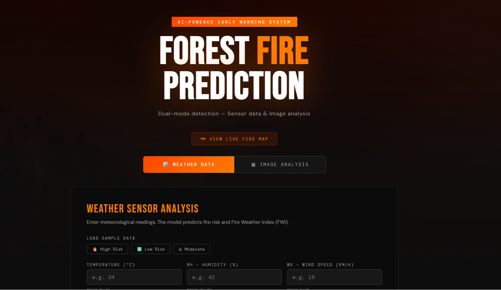
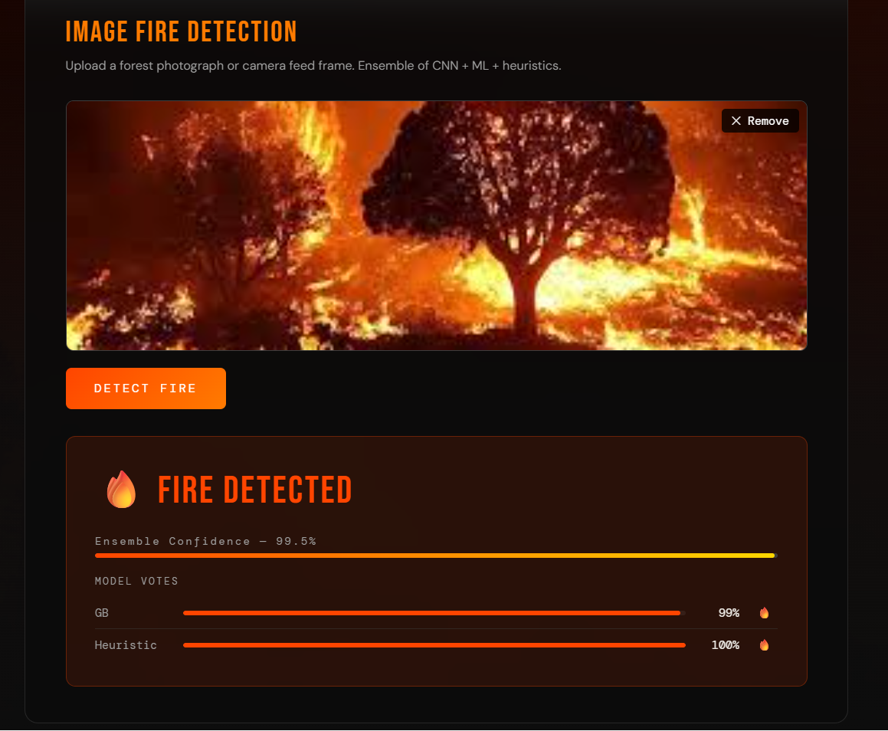
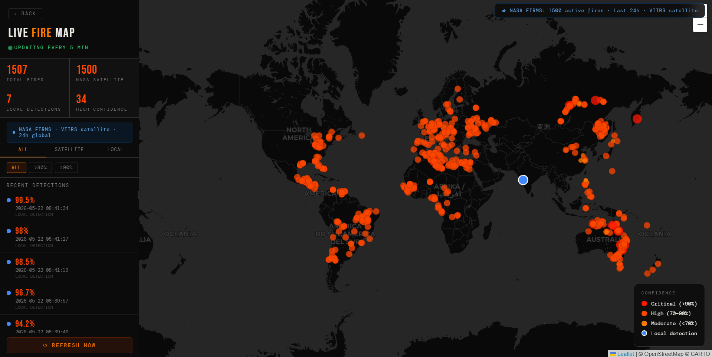

# 🔥 Forest Fire Detection & Prediction System

<div align="center">


**An AI-powered wildfire monitoring system that combines deep learning, machine learning, and real-time NASA satellite fire data to detect and predict forest fire risks.**

[🌐 Live Demo](https://forest-fire-1-vybj.onrender.com) · [📂 Source Code](https://github.com/kanishkaaa13/forest-fire) · [🗺️ Live Fire Map](https://forest-fire-1-vybj.onrender.com/map)

</div>

---

## 📸 Screenshots

### 🏠 Home — Image Fire Detection


### 🔥 Detection Result — 98.9% Confidence


### 🗺️ Live NASA Satellite Fire Map


---

## ✨ Features

| Feature | Description |
|---|---|
| 🖼️ **Image Fire Detection** | Upload any forest photo — ensemble AI detects fire/smoke |
| 🌡️ **Weather Risk Prediction** | Enter climate indices → fire risk + FWI danger level |
| 🤖 **Ensemble ML System** | CNN + Gradient Boosting + Smart Heuristic combined |
| 🛰️ **Live Satellite Map** | Real-time NASA FIRMS fire data (VIIRS NOAA-20, last 24h) |
| 📍 **Local Detection Pins** | Your fire detections appear live on the global map |
| 📊 **Confidence Scoring** | Per-model vote breakdown with ensemble confidence % |
| ⚡ **Real-time Predictions** | Sub-second inference via lightweight GB + heuristic |
| 📱 **Responsive UI** | Dark-themed, mobile-friendly design |
| ☁️ **Cloud Deployed** | Live on Render — no setup required |

---

## 🧠 AI / ML Architecture

```
User uploads image
        ↓
┌───────────────────────────────────────────┐
│   ENSEMBLE PREDICTION ENGINE              │
│                                           │
│  ① CNN — MobileNetV3  (weight = 4)       │
│     224×224 → deep feature extraction    │
│                                           │
│  ② Gradient Boosting  (weight = 2)       │
│     128×128 → 58 handcrafted features    │
│     RGB histograms + HSV stats + masks   │
│                                           │
│  ③ Smart Heuristic    (weight = 1)       │
│     Pixel-level fire/smoke detection     │
│     Rejects: autumn leaves, red cars,    │
│              sunsets, solid objects      │
└───────────────────────────────────────────┘
        ↓
  Weighted vote → Final prediction
        ↓
  Hard override if CNN > 88% or < 15%
        ↓
  🔥 FIRE DETECTED / ✅ NO FIRE  +  Confidence %
```

### Model Weights & Roles

| Model | Weight | Input | Purpose |
|---|---|---|---|
| MobileNetV3 CNN | 4 (primary) | 224×224 image | Deep visual fire/smoke patterns |
| Gradient Boosting | 2 | 58 color features | Handcrafted fire pixel analysis |
| Smart Heuristic | 1 (fallback) | Pixel HSV values | Rule-based fire detection |

### Weather Prediction Pipeline

```
10 Climate Indices  →  StandardScaler  →  GradientBoosting  →  Fire Risk (0/1)
(Temp, RH, Wind,                                            →  FWI Danger Level
 Rain, FFMC, DMC,         +  Heuristic override rules          (Low/Moderate/
 DC, ISI, BUI, FWI)       (heavy rain → No Fire, etc.)          High/Extreme)
```

---

## 📊 Dataset

| Dataset | Source | Size | Use |
|---|---|---|---|
| **Algerian Forest Fires** | [UCI ML Repository](https://archive.ics.uci.edu/dataset/547/algerian+forest+fires+dataset) | 246 records | Tabular fire risk classification |
| **Forest Fire Images** | Custom (fire/ + nofire/ folders) | 10,000+ images | Image model training |
| **NASA FIRMS** | [NASA FIRMS API](https://firms.modaps.eosdis.nasa.gov/) | Live, 24h global | Real-time satellite fire map |

The Algerian dataset covers **Bejaia and Sidi Bel-abbes regions, June–September 2012** with 10 Fire Weather Index features.

---

## 🛠️ Tech Stack

<table>
<tr><td><b>Backend</b></td><td>Python 3.11, Flask 3.1, Gunicorn</td></tr>
<tr><td><b>ML / AI</b></td><td>scikit-learn, PyTorch, torchvision, NumPy, Pillow</td></tr>
<tr><td><b>Satellite Data</b></td><td>NASA FIRMS API (VIIRS NOAA-20, real-time CSV)</td></tr>
<tr><td><b>Frontend</b></td><td>HTML5, Vanilla CSS, JavaScript, Leaflet.js</td></tr>
<tr><td><b>Deployment</b></td><td>Render (free tier), GitHub Actions CI</td></tr>
<tr><td><b>Maps</b></td><td>Leaflet.js + CartoDB dark tiles</td></tr>
</table>

---

## 🚀 Quick Start (Local)

```bash
# 1. Clone
git clone https://github.com/kanishkaaa13/forest-fire.git
cd forest-fire

# 2. Install dependencies
pip install -r requirements.txt

# 3. (Optional) Retrain models
python train_models.py   # tabular + GB image model
python train_cnn.py      # CNN (requires torch + timm)

# 4. Run
python app.py
# → Open http://localhost:8080
```

> **Note:** The pre-trained `.pkl` and `.pth` model files are already included in `models/`. Step 3 is only needed if you want to retrain from scratch.

---

## 📂 Project Structure

```
forest-fire/
│
├── app.py                  ← Flask app (all routes + inference logic)
├── train_models.py         ← Train tabular + GB image models
├── train_cnn.py            ← Train CNN (MobileNetV3 via timm)
├── requirements.txt        ← Production dependencies
├── render.yaml             ← Render.com deployment config
├── Procfile                ← Gunicorn start command
├── railway.toml            ← Railway.app deployment config
├── runtime.txt             ← Python 3.11.9
│
├── models/
│   ├── classifier.pkl      ← Tabular GradientBoosting classifier
│   ├── regressor.pkl       ← FWI Ridge regressor
│   ├── scaler.pkl          ← StandardScaler
│   ├── image_model.pkl     ← GB image classifier
│   ├── cnn_fire_model.pth  ← MobileNetV3 CNN weights
│   └── cnn_meta.pkl        ← CNN metadata
│
├── dataset/
│   ├── Algerian_forest_fires_dataset.csv
│   └── images/
│       ├── fire/           ← Fire training images
│       └── nofire/         ← No-fire training images
│
└── templates/
    ├── index.html          ← Main prediction UI
    └── map.html            ← Live satellite fire map
```

---

## 🌐 API Endpoints

| Endpoint | Method | Description |
|---|---|---|
| `/` | GET | Main prediction UI |
| `/map` | GET | Live NASA fire map |
| `/predict_image` | POST | Image fire detection |
| `/predict_tabular` | POST | Weather-based fire risk |
| `/get_fire_events` | GET | NASA FIRMS + local detections |
| `/health` | GET | Healthcheck endpoint |

---

## 🔮 Future Improvements

- [ ] 🚁 Real-time drone/CCTV feed integration
- [ ] 🌦️ Automatic weather API integration (no manual input)
- [ ] 📱 Mobile app (React Native / Flutter)
- [ ] 🗺️ Fire spread prediction & perimeter mapping
- [ ] 🔔 Alert system (SMS / email notifications)
- [ ] 🛰️ Higher-resolution satellite imagery (Sentinel-2)
- [ ] 🧮 Retrain CNN with torchvision (remove timm dependency)
- [ ] 💾 Persistent detection history (database storage)

---

## 📜 License

This project is licensed under the **MIT License** — feel free to use, modify, and distribute.

---

<div align="center">

Made with 🔥 by [Kanishka](https://github.com/kanishkaaa13)

⭐ Star this repo if you found it useful!

</div>
